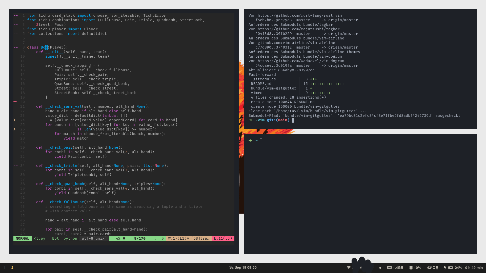
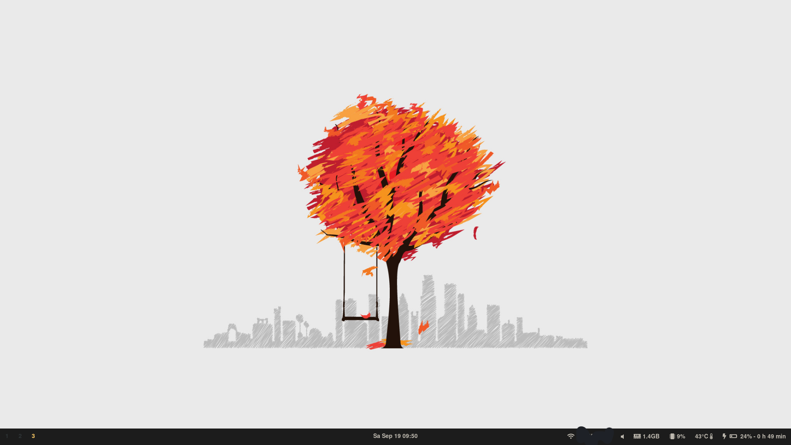

# my .config files
I sync some of my .config using github.

This is how my [sway](https://github.com/swaywm/sway) desktop looks:

You can find the wallpaper at [https://wallpaperaccess.com/download/minimalist-tree-2100331](https://wallpaperaccess.com/download/minimalist-tree-2100331) (09/19/20)
